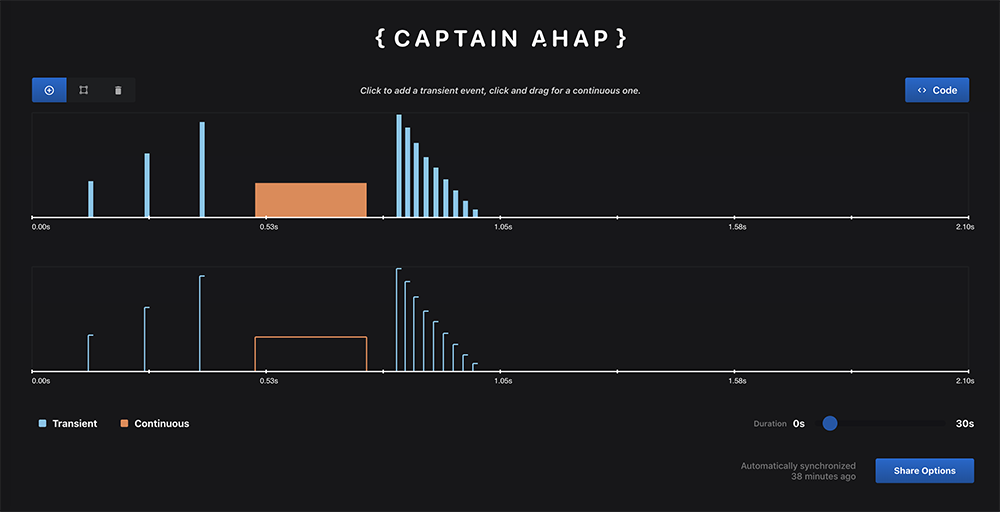

  

Moby is a simple app that lets you download and test AHAP (Apple Haptic and Audio Pattern) files.
Please note that `CoreHaptics` is only avaialble in iOS 13, so make sure to run this with Xcode 11.
You can use our [Catain AHAP](https://ahap.fancypixel.it/) web app to design your own haptic files graphically:

  

## Usage

Build and run on a device to fel the haptics.

# Author
Built by [Fancy Pixel](https://fancypixel.it). We're available for hire, feel free to contact us!

# MIT License
    The MIT License (MIT)

    Copyright (c) 2019 Fancy Pixel S.r.l.

    Permission is hereby granted, free of charge, to any person obtaining a copy of
    this software and associated documentation files (the "Software"), to deal in
    the Software without restriction, including without limitation the rights to
    use, copy, modify, merge, publish, distribute, sublicense, and/or sell copies of
    the Software, and to permit persons to whom the Software is furnished to do so,
    subject to the following conditions:

    The above copyright notice and this permission notice shall be included in all
    copies or substantial portions of the Software.

    THE SOFTWARE IS PROVIDED "AS IS", WITHOUT WARRANTY OF ANY KIND, EXPRESS OR
    IMPLIED, INCLUDING BUT NOT LIMITED TO THE WARRANTIES OF MERCHANTABILITY, FITNESS
    FOR A PARTICULAR PURPOSE AND NONINFRINGEMENT. IN NO EVENT SHALL THE AUTHORS OR
    COPYRIGHT HOLDERS BE LIABLE FOR ANY CLAIM, DAMAGES OR OTHER LIABILITY, WHETHER
    IN AN ACTION OF CONTRACT, TORT OR OTHERWISE, ARISING FROM, OUT OF OR IN
    CONNECTION WITH THE SOFTWARE OR THE USE OR OTHER DEALINGS IN THE SOFTWARE.
